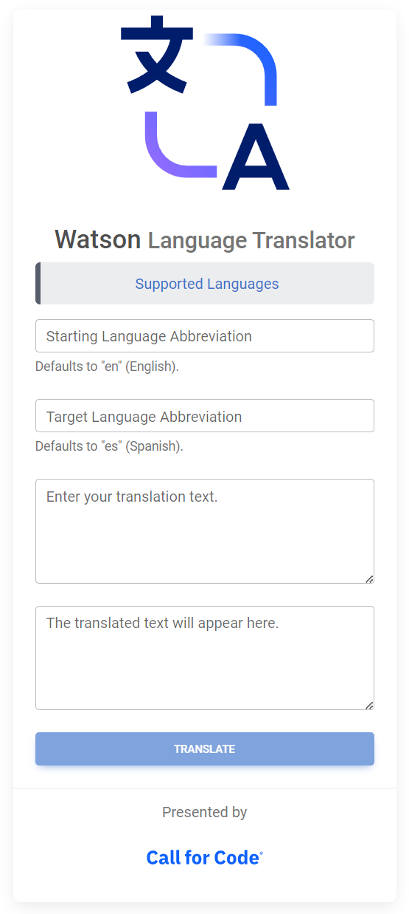

# Watson API Playground

Welcome to the Watson APIs playground! An online demo is available [here](https://callforcode-wap.apps.ocpvirt.austin.ourlab.cloud/).

## Available APIs

- Language Translator
  > 

## Coming soon

- Speech to Text
- Text to Speech
- Watson Assistant

## Built on

- React v18
- Node JS v16
- Material Design for Bootstramp

## Deploy

To deploy locally, suggest review of this [article](./development/docker/README.md).

## Participant

- Register for the [Call for Code Global Challenge](https://developer.ibm.com/callforcode/global-challenge/).

## Need help?

- Open an issue.
- Join the **Call for Code** Slack workspace. Then reach out in the `helpdesk` channel.
